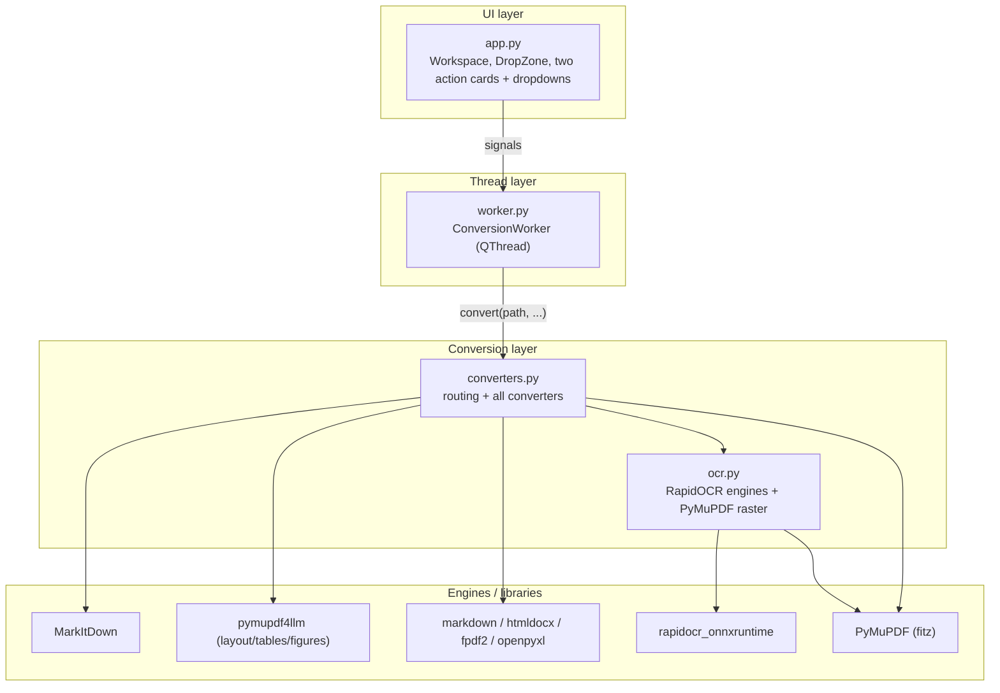
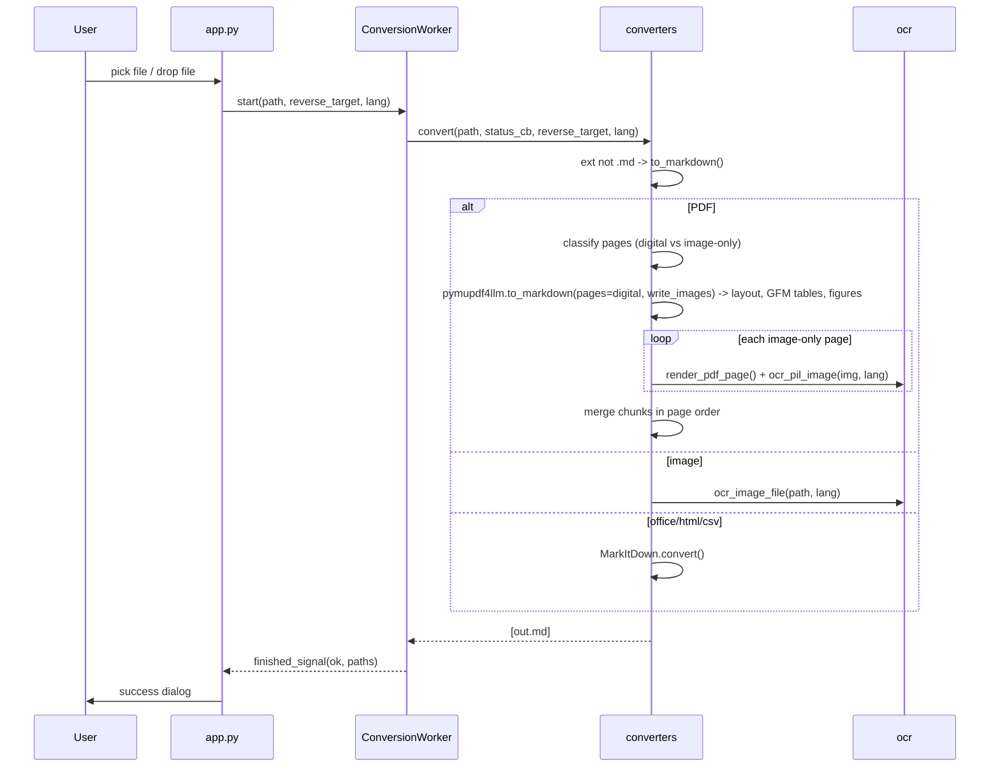
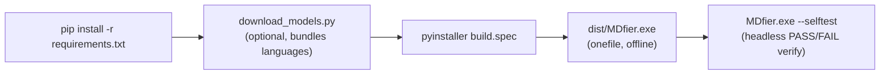

# Architecture

Technical reference for developers working on **MDfier** - an offline desktop app that converts documents to/from Markdown. Read this before extending the codebase.

## Design principles

1. **Offline-first.** No network calls at runtime. OCR models and fonts are bundled into the exe. (Only `download_models.py`, a build-time helper, touches the network.)
2. **Responsive UI.** All conversion/OCR runs on a worker thread; the Qt GUI thread never blocks.
3. **Layered and decoupled.** UI -> worker -> converters -> (MarkItDown | OCR). Lower layers never import upper layers.
4. **Lazy + cached heavy imports.** `markitdown`, `fitz`, `rapidocr_onnxruntime`, `fpdf`, `htmldocx`, `openpyxl` are imported inside functions so app startup stays fast; engines are created once and cached.
5. **Pure-function converters.** Everything in `converters.py` is a plain function returning a list of output paths - trivially testable without Qt.

## Component overview



## Modules

| File | Responsibility | Key symbols |
|---|---|---|
| `app.py` | PyQt6 GUI: branded header (logo + tagline, text fallback), two action cards - (1) a single "any file -> Markdown" button with the OCR-language dropdown, (2) a "Markdown -> format" dropdown + button - plus a drag-and-drop zone, status bar + progress, busy-state locking, a Cancel button, a large-file confirmation guard, a graceful `closeEvent`, and a headless `--selftest` mode. Sets the window/taskbar icon and Windows AppUserModelID. | `Workspace`, `DropZone`, `resource_path`, `_build_appbar`, `cancel_job`, `_confirm_large`, `closeEvent`, `run_selftest`, `REVERSE_LABELS`, `TO_MD_FILTER`, `STYLESHEET`, `main()` |
| `worker.py` | Bridges UI and logic. Runs one conversion off-thread and emits `status_signal` / `finished_signal`. Passes `isInterruptionRequested` as `cancel_cb` and maps `converters.Cancelled` to a neutral `(False, "Cancelled")` result. | `ConversionWorker(QThread)` |
| `converters.py` | All conversion logic + routing. Forward (to Markdown) and reverse (from Markdown). Pure functions. Outputs are routed through `_unique_path` so nothing is overwritten; `Cancelled`/`_check_cancel` enable cooperative abort. | `convert`, `to_markdown`, `from_markdown`, `pdf_to_markdown`, `markdown_to_*`, `extract_markdown_tables`, `_unique_path`, `Cancelled`, `_check_cancel`, `_as_blockquote`, `_strip_boundary_overlap`, `_retag_figures` |
| `ocr.py` | OCR subsystem: per-language RapidOCR engine cache, language->model registry, PDF page rasterization. | `LANG_TO_MODEL`, `MODEL_FILES`, `get_engine`, `available_languages`, `ocr_pil_image`, `render_pdf_page` |
| `download_models.py` | Build-time fetch of PP-OCRv4 script models into `assets/ocr_models/`. | `download`, `main` |
| `build.spec` / `build.bat` | PyInstaller onefile packaging; bundles models/fonts via recursive `assets/` walk. | - |

## Runtime data flow

### Forward: document -> Markdown (with hybrid PDF OCR)



### Reverse: Markdown -> docx/html/pdf/txt/xlsx/csv
`convert()` sees a `.md`/`.markdown` extension and calls `from_markdown(path, target)`, which dispatches via `_REVERSE_DISPATCH` to the matching `markdown_to_*`. Tables for xlsx/csv come from `extract_markdown_tables()`; PDF rendering uses `_render_markdown_pdf()` with a registered Unicode font.

## Threading model

- Exactly one `ConversionWorker` runs at a time. `app.py` guards with `self.worker is not None` and disables the action buttons + dropdowns via `_set_busy()` (which also toggles the Cancel button).
- Progress bar is indeterminate (`setRange(0,0)`) while busy.
- `status_cb` is the worker's `status_signal.emit`; converters call it to report progress (e.g. "Page 3/8: OCR"). Cross-thread delivery is handled by Qt's queued signal/slot connections.
- **Cooperative cancellation.** The Cancel button calls `worker.requestInterruption()`. The worker passes `isInterruptionRequested` to `convert(..., cancel_cb=...)`; `_check_cancel()` is polled at entry and at each scanned-PDF page boundary, raising `converters.Cancelled`, which the worker reports as a neutral cancelled result (no error dialog). Single blocking library calls (e.g. one MarkItDown/`pymupdf4llm` pass) cannot be interrupted mid-call - cancellation takes effect at the next checkpoint.
- **Clean shutdown / guards.** `closeEvent` interrupts and `wait()`s a running worker so no thread is orphaned. `_confirm_large()` prompts before starting jobs over ~100 MB or ~300 PDF pages (`LARGE_FILE_MB`, `LARGE_PDF_PAGES`).
- **Non-destructive outputs.** Every converter resolves its target through `converters._unique_path`, auto-incrementing to `name (1).ext` (and `name_images (1)` for figure folders) when a path already exists.

## OCR subsystem

- **Engine cache:** `ocr._ENGINES` keyed by model name (or `"_builtin"`). `get_engine(lang)` builds `RapidOCR()` (built-in en+zh) or `RapidOCR(rec_model_path=...)` for a script model. Missing model files fall back to built-in instead of crashing.
- **Language registry:** `LANG_TO_MODEL` maps a friendly language name to a script model key (`None` = built-in). Multiple languages can share one model (e.g. Spanish/French/Portuguese/German -> `latin`).
- **Models:** PP-OCRv4 recognition ONNX files under `assets/ocr_models/<model>/`. The character dictionary is embedded in the ONNX, so no separate dict file is needed.
- **`available_languages()`** returns only languages whose model is present (built-in always listed). `app.py` populates the dropdown from this, so the UI never offers a missing model.
- **Hybrid layout-aware PDF:** `converters.pdf_to_markdown` classifies pages by `page.get_text()` length (`PDF_PAGE_TEXT_THRESHOLD`, default 15). Digital pages go through `pymupdf4llm.to_markdown(pages=..., page_chunks=True, write_images=True)` for multi-column reading order, GitHub-flavored Markdown tables, and figure extraction. Image-only pages are OCR'd with RapidOCR in the selected language. Chunks are merged by `metadata["page_number"]`.
- **No double-read (`use_ocr=False`):** `pymupdf4llm 1.27+` bundles `pymupdf_layout`, whose layout engine defaults to `force_text=True` AND `use_ocr=True` - it emits the text layer and *also* OCRs the same image regions, doubling/echoing tokens (e.g. `Pd(OAc)2/dppb/dppb`). Because we run our own language-aware RapidOCR on scanned pages, the digital-page call passes `use_ocr=False, force_text=True`, so each token is read exactly once.
- **OCR isolation (`_as_blockquote`):** scanned-page OCR text is wrapped in a Markdown blockquote with an `**OCR text (scanned page N):**` header, marking it as secondary, image-derived context for downstream LLMs/RAG instead of inline body flow.
- **Boundary guard (`_strip_boundary_overlap`):** during the page merge, an exact-match (post-strip, length >= 8) duplicate line repeated across a page boundary is dropped once. Exact-match only, so legitimate repeated content (e.g. `C-C`) is preserved.
- **Figures:** extracted images land in `<base>_images/`; `_retag_figures()` rewrites bare `` refs to relative paths with placeholder alt-text (`![Figure (page N): file]`).

## Conversion matrix

| Direction | Formats | Engine |
|---|---|---|
| To MD | pdf | pymupdf4llm (layout, tables, figures) for digital pages + RapidOCR for scanned pages |
| To MD | png/jpg/jpeg/bmp/tif/tiff/gif/webp | RapidOCR (drag-and-drop) |
| To MD | docx/pptx/html/json/xml/txt/epub/rtf | MarkItDown |
| From MD | docx | markdown -> HTML -> htmldocx |
| From MD | html | markdown |
| From MD | pdf | fpdf2 (+ Unicode font) |
| From MD | txt | markdown -> HTML -> strip tags |
| From MD | xlsx | GFM tables -> openpyxl (line-per-row fallback) |
| From MD | csv | GFM tables -> csv (line-per-row fallback) |

## Extending the app

### Add a new INPUT format (to Markdown)
1. If MarkItDown supports it: add the extension to `TO_MARKDOWN_EXTS` in `converters.py`. `generic_to_markdown` handles it, and the single "to Markdown" file filter (`TO_MD_FILTER`, built from `TO_MARKDOWN_EXTS`) picks it up automatically - no UI change needed.
2. If it needs custom handling: add a function in `converters.py` and branch in `to_markdown()`.

### Add a new REVERSE target (from Markdown)
1. Write `markdown_to_<fmt>(path, status_cb) -> List[str]` in `converters.py`.
2. Register it in `_REVERSE_DISPATCH` and `REVERSE_TARGETS`.
3. Add `(label, value)` to `REVERSE_LABELS` in `app.py`; it appears in the output-format dropdown automatically.

### Add a new OCR language
1. If it shares an existing script model: add one line to `LANG_TO_MODEL` (e.g. `"Italian": "latin"`). Done - no download needed.
2. If it needs a new script model: add the key to `MODEL_FILES` (the ONNX filename), add the language to `LANG_TO_MODEL`, then `python download_models.py <key>` and rebuild. `available_languages()` and the dropdown pick it up automatically.

## Packaging pipeline



- `build.spec` uses `collect_all` for `rapidocr_onnxruntime`, `onnxruntime`, `markitdown`, `fpdf`, `pymupdf`, `pymupdf4llm`, `pymupdf_layout`; `collect_submodules` for `markitdown` and `pdfminer`; and `copy_metadata` for `onnxruntime`/`rapidocr_onnxruntime`/`pymupdf4llm`/`markitdown` (some libs read their version via `importlib.metadata` at runtime). It recursively bundles `assets/` (fonts, logo/icon, OCR models) and sets the exe `icon` to `assets/app.ico`.
- `resource_path()` (in `app.py`, `converters.py`, and `ocr.py`) resolves bundled files via `sys._MEIPASS` at runtime, or the script dir when run from source. `app.py` uses it for the header logo (`assets/logo.png`) and window icon (`assets/app.ico`).
- **Branding.** `assets/logo.png` is the source mark; `assets/app.ico` (multi-size) is derived from it with Pillow. On Windows, `main()` sets `SetCurrentProcessExplicitAppUserModelID("MDfier.App")` so the taskbar uses the app icon. If the logo asset is missing, the header falls back to a styled "MDfier" text wordmark.
- **Self-test.** `MDfier.exe --selftest` (and `python app.py --selftest`) runs `run_selftest()`: every model-free conversion against generated samples, writing `mdfier_selftest.log` and exiting `0`/`1`. CI uses this to verify the frozen exe actually runs.

## File layout

```
.md_project/
  app.py              # GUI
  worker.py           # QThread bridge
  converters.py       # all conversion logic
  ocr.py              # OCR engines + language registry
  download_models.py  # build-time model fetcher
  build.spec          # PyInstaller config
  build.bat           # one-shot build script
  requirements.txt
  assets/
    logo.png          # brand mark (header + icon source)
    icon.png          # square icon (derived)
    app.ico           # multi-size Windows icon (derived from logo.png)
    DejaVuSans.ttf    # optional Unicode font for PDF (falls back to Arial)
    ocr_models/<key>/*.onnx  # bundled language models
  tests/              # unittest suite (converters + ocr)
  .github/workflows/ci.yml   # tests + exe build + --selftest
  dist/MDfier.exe     # build output
```

## Known limitations / future work

- Excel (`.xlsx`/`.xls`) and CSV are not accepted as INPUT (removed from `TO_MARKDOWN_EXTS`): spreadsheet -> Markdown is lossy (sheets/merged cells/formulas). CSV is already model-readable plain text; Excel users can save as CSV. The reverse (`.md -> .xlsx/.csv`) is unaffected.
- `.md -> pptx` has no reliable pure-Python reverse path (out of scope).
- Bengali has no PP-OCR ONNX model, so it is not offered.
- Legacy binary `.ppt` may fail in MarkItDown (use `.pptx`); the error surfaces in the failure dialog.
- A PDF with figures now produces a `.md` plus a sibling `<base>_images/` folder (no longer always a single file).
- Vector-graphic extraction can occasionally capture minor decorative graphics; DPI/image handling in `pdf_to_markdown` is tunable.
- With `use_ocr=False`, a page classified "digital" (has body text) that also contains an un-texted scheme image will not have that image auto-OCR'd; the figure is still extracted and tagged. Lower `PDF_PAGE_TEXT_THRESHOLD` if such pages should route to the scanned/OCR path instead.
- Single concurrent job by design; no batch/folder mode yet.
- Cancellation is cooperative: it stops at the next checkpoint (job entry, scanned-PDF page boundary). A single long blocking library call (one `pymupdf4llm`/MarkItDown pass over a large digital PDF) finishes before the cancel registers.

## Testing

- `tests/test_converters.py` (stdlib `unittest`, no extra deps) covers the pure logic: `_strip_boundary_overlap`, `_as_blockquote`, `extract_markdown_tables` (including escaped pipes), `_strip_inline`, `_unique_path` (file + directory auto-increment), the Excel/CSV input limitation, and reverse conversions (`markdown_to_csv`/`markdown_to_txt`). Two tests inject fake `fitz`/`pymupdf4llm`/`ocr` modules to assert `pdf_to_markdown` calls the layout engine with `use_ocr=False`/`force_text=True` and blockquotes scanned pages.
- `tests/test_ocr.py` covers the language registry: every script language in `LANG_TO_MODEL` maps to a `MODEL_FILES` entry, built-in languages are present, and `available_languages()` filters by on-disk model presence (mocking `os.path.exists`).
- Run: `\.venv\Scripts\python.exe -m unittest discover -s tests -v`.
- CI (`.github/workflows/ci.yml`) runs the suite on Windows, builds `MDfier.exe`, runs `MDfier.exe --selftest`, uploads the exe artifact, and publishes a release on `v*` tags.
