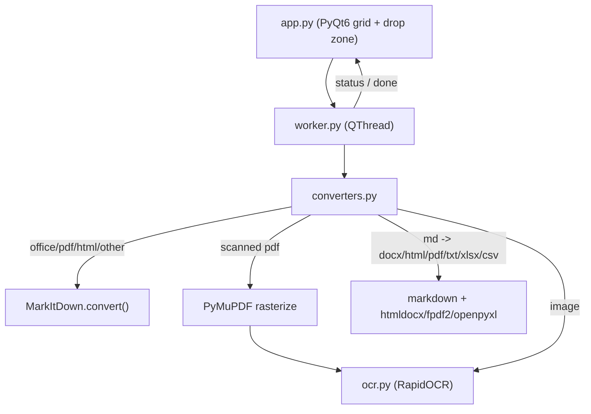

# MDfier — Complete Build Plan

## Goal
A privacy-first, 100% offline desktop app (`D:\local_codee\.md_project`) that converts PDF/DOCX/PPTX/HTML/images (incl. scanned docs via OCR) **to** Markdown, and Markdown **back** to routine document formats (DOCX, HTML, PDF, TXT, XLSX, CSV). The UI is a clean two-action layout (Any file → Markdown; Markdown → other format) with a drag-and-drop zone that auto-detects direction. Shipped as a portable `.exe` (plus a one-window **MDfier Lite** build).

> **As-built note:** Excel (`.xlsx`/`.xls`) and CSV were dropped as *inputs* (spreadsheet → Markdown is lossy; CSV is already model-readable). The reverse direction (Markdown → XLSX/CSV) is still supported.

## Key technical decisions
- **OCR:** RapidOCR (onnxruntime) instead of EasyOCR — ~10x smaller exe, models bundled, no PyTorch, fully offline.
- **UX:** Two action cards (forward / reverse) with dropdowns, plus a shared drag-and-drop zone. (An earlier PDFill-style button grid was simplified to this.)
- **Dependencies:** `markitdown[docx,pptx,pdf]` only (not `[all]`) — keeps the build lean and fully offline (no Azure/YouTube/audio backends).

## Supported conversions

### To Markdown (input formats)
| Input | Method |
|---|---|
| PDF (layout-aware hybrid) | pymupdf4llm (multi-column, GFM tables, figures) for digital pages; RapidOCR for scanned pages |
| Word `.docx` | MarkItDown |
| PowerPoint `.pptx` | MarkItDown |
| Images `.png`/`.jpg` (OCR, drag-and-drop) | RapidOCR |
| HTML / JSON / XML / TXT / EPUB / other | MarkItDown |

> Excel `.xlsx`/`.xls` and CSV are intentionally **not** accepted as inputs (see the as-built note above).

OCR language is selectable (11 languages via ~7 PP-OCR script models; English/Chinese built-in). Images convert via drag-and-drop (no dedicated grid button).

### From Markdown (6 routine targets)
| Output | Method |
|---|---|
| `.md` → `.docx` | `markdown` → HTML → `htmldocx` |
| `.md` → `.html` | `markdown` |
| `.md` → `.pdf` | `fpdf2` + optional DejaVuSans Unicode TTF (falls back to a system font) |
| `.md` → `.txt` | `markdown` → HTML → strip tags (single path, no fragile regex) |
| `.md` → `.xlsx` | parse GFM pipe tables → `openpyxl` (one sheet per table; line-per-row fallback if no tables) |
| `.md` → `.csv` | parse GFM pipe tables → stdlib `csv` (one CSV per table; line-per-row fallback if no tables) |

## Corrections vs. draft code
- Scanned PDFs are rasterized with **PyMuPDF (`fitz`)** page-by-page, then OCR'd.
- `.md → .docx` uses `markdown` → HTML → `htmldocx` (handles headings, lists, bold/italic, tables, code).
- `MarkItDown()` and the OCR engine are created **once** and cached, not per job.
- Add real `dragEnterEvent` / `dropEvent` handling.

## Architecture

## Files to create (all under `D:\local_codee\.md_project`)
- `PLAN.md` — this file.
- `requirements.txt` — pinned, tested versions of: `markitdown[docx,pptx,pdf]`, `PyQt6`, `python-docx`, `markdown`, `htmldocx`, `rapidocr-onnxruntime`, `onnxruntime`, `PyMuPDF`, `pymupdf4llm`, `Pillow`, `fpdf2`, `openpyxl`. (`csv`, `html.parser` are stdlib.)
- `assets/DejaVuSans.ttf` — optional Unicode font for `fpdf2` PDF output (not included by default; falls back to a system font such as Arial when absent).
- `assets/app.ico` — optional app icon; build falls back gracefully if absent.
- `LICENSE` — AGPL-3.0 (required by bundled PyQt6/PyMuPDF copyleft); see `THIRD_PARTY_NOTICES.md`.
- `README.md` — usage, build steps, supported formats, offline/privacy note.
- `ocr.py` — lazy-loaded RapidOCR singleton + `ocr_image(pil_or_path)` and PDF-page helper via PyMuPDF.
- `converters.py` — pure functions: `to_markdown(path)`, `scanned_pdf_to_markdown(path)`, `image_to_markdown(path)`, `markdown_to_docx(path)`, `markdown_to_html(path)`, `markdown_to_pdf(path)`, `markdown_to_txt(path)`, `markdown_to_xlsx(path)`, `markdown_to_csv(path)`, plus a shared `extract_markdown_tables(md)` helper.
- `worker.py` — `ConversionWorker(QThread)` with `status_signal` / `finished_signal`; dispatches to `converters.py`; uses cached engine instances.
- `app.py` — main window. Branded header (logo + tagline, text fallback), two action cards (Any file → Markdown with OCR-language dropdown; Markdown → format with output-format dropdown), a drag-and-drop `QFrame` zone, status label + `QProgressBar`, a Cancel button, large-file guard, and a `--selftest` mode. Global Fusion stylesheet.
- `build.spec` + `build.bat` — PyInstaller config that `collect_all`s `rapidocr_onnxruntime`, `onnxruntime`, `markitdown`, `magika`, `fpdf`, `pymupdf`, `pymupdf4llm` so OCR models and file-type models ship inside the exe; bundles `assets/` (incl. `DejaVuSans.ttf` if present) and `LICENSE`/`THIRD_PARTY_*` via `datas`; excludes the unused markitdown backends; `--noconsole --onefile`, optional `assets/app.ico`.
- `build_lite.spec` — same packaging, entry point `lite_app.py`, builds `MDfier-Lite.exe`.
- `lite_app.py` — **MDfier Lite**: a single-window GUI (one drop zone + output-format pills + OCR-language dropdown) reusing the same converters/worker/ocr backend.
- `gen_notices.py` + `THIRD_PARTY_NOTICES.md` + `THIRD_PARTY_LICENSES.txt` — generated attribution and full bundled license texts (AGPL-3.0 compliance).

## UI (as built)
- **Action 1 — Any file → Markdown:** one file picker (all supported inputs) + an OCR-language dropdown for scanned PDFs/images.
- **Action 2 — Markdown → other format:** an output-format dropdown (DOCX/HTML/PDF/TXT/XLSX/CSV) + a `.md` file picker.
- Shared drag-and-drop zone auto-detects direction by extension (`.md` → reverse; everything else → to-Markdown; images → OCR).
- Busy state disables actions and shows a **Cancel** button; a large-file guard confirms before huge inputs.
- **MDfier Lite** (`lite_app.py`) collapses this into a single drop zone with format "pills".

## Behavior details
- Output written next to the source file (`base + .md` / `.docx` / `.html` / `.pdf` / `.txt` / `.xlsx` / `.csv`); on success show a message box with the path.
- PDF flow (as built): classify each page by text length; digital pages go through `pymupdf4llm.to_markdown(..., use_ocr=False, force_text=True)` for layout/tables/figures (read once, no echo bug); image-only pages are rasterized with PyMuPDF and OCR'd by RapidOCR, then isolated in a Markdown blockquote.
- `.md → xlsx/csv`: extract GFM pipe tables; multiple tables → one sheet per table (`xlsx`) or one file per table (`base_table1.csv`, `base_table2.csv`, ...); if no tables found, fall back to one non-empty line per row.
- `.md → pdf`: register DejaVuSans if present (else system font) so Unicode text renders; `fpdf2.write_html` covers headings/lists/bold/simple tables (CSS/images out of scope for v1).
- Heavy work stays on the worker thread so the UI never freezes; progress bar runs indeterminate during OCR.
- Drag-and-drop auto-detect by extension: `.pdf/.docx/.xlsx/.csv/.pptx/.html/.png/.jpg/.jpeg` → to-Markdown; `.md` → reverse with output-format dropdown (default DOCX); images go through OCR.

## Packaging
- `pyinstaller build.spec` produces a single portable `.exe` needing no install; first launch works offline since OCR models are bundled.

## Verification
- Run `python app.py`, test one file per category (a digital PDF, a scanned PDF, docx, pptx, png, and a sample `.md` → docx/html/pdf/txt/xlsx/csv, including a `.md` with and without tables), then build and re-test the exe (`MDfier.exe --selftest`).

## Out of scope (can add later)
- `.md` → PPTX (no reliable pure-Python reverse path).
- RTF / ODT output (lower-value; possible in a later iteration).
- Batch/folder conversion. (Multi-language OCR is implemented — 11 languages via PP-OCR script models.)