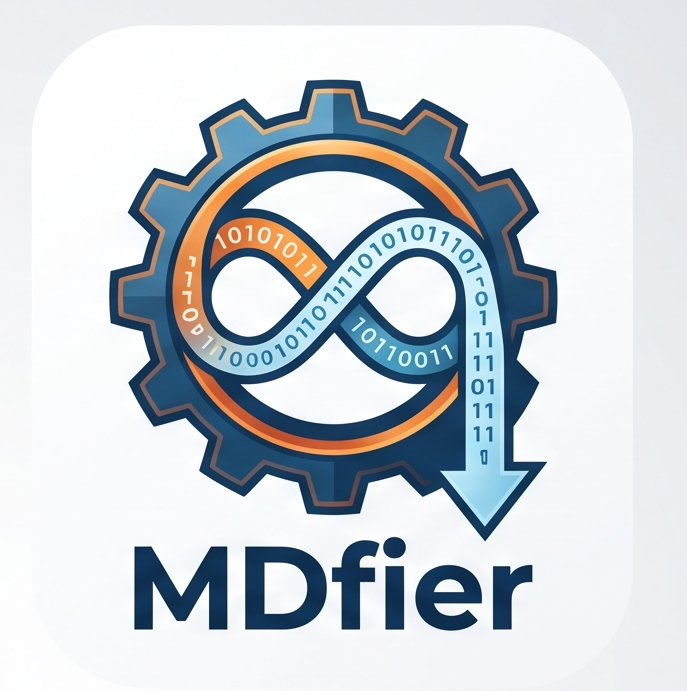

<p align="center">
  
</p>

# MDfier

[](https://github.com/sameer24688-jpg/MDfier/actions/workflows/ci.yml)
[](https://www.gnu.org/licenses/agpl-3.0)
[](https://github.com/sameer24688-jpg/MDfier/releases/latest)
[](#why-mdfier-built-for-ai--llm-workflows)

> **Download:** grab the latest `MDfier.exe` (full) or `MDfier-Lite.exe` (simplest UI) from the [**Releases page**](https://github.com/sameer24688-jpg/MDfier/releases/latest) — double-click and go.

> **Turn any document into clean, LLM-ready Markdown — drag, drop, done.**
> Feed PDFs, Word docs, slides, and images to ChatGPT, Claude, Gemini, or your
> RAG pipeline **without the formatting noise that wastes tokens**.

**MDfier** is a privacy-first, **100% offline** desktop app that converts documents **to Markdown** (and Markdown **back** to common office formats). Built on [Microsoft MarkItDown](https://github.com/microsoft/markitdown) with a dead-simple drag-and-drop UI. Ships as a single portable `.exe` — **no install, no Python, no command line, no account.**

Nothing leaves your machine: parsing and OCR run locally.

## Why MDfier? (Built for AI & LLM workflows)

Copy-pasting a PDF or Word file into an AI chat is messy and expensive: binary
formats can't be pasted at all, and raw exports carry layout junk, repeated
headers/footers, and broken tables that **burn tokens and confuse the model.**
MDfier fixes that:

- **Fewer tokens, lower cost.** Markdown is compact, plain text. Stripping a
  document down to clean Markdown typically removes a large chunk of structural
  noise, so the model spends its context window on *content*, not formatting.
- **Better answers.** Clean headings, lists, and GitHub-flavored tables preserve
  the document's structure so the LLM actually understands it. Scanned text is
  OCR'd and clearly labelled so it won't pollute the main text.
- **Less friction.** No converting to text by hand, no copy-paste cleanup. Drag
  a file in, get a `.md` you can paste anywhere or attach to any tool.
- **Private by default.** 100% offline — perfect for confidential or internal
  documents you can't upload to a cloud converter.

### Two ways to use it

1. **Standalone (non-technical):** download the `.exe`, drag a file onto it, and
   paste the resulting Markdown into ChatGPT / Claude / Gemini / NotebookLM, or
   drop it into your notes/Obsidian vault. That's it.
2. **As a pre-processing step / "skill" in an AI pipeline:** run it on a folder
   of documents to produce Markdown for **RAG ingestion, embeddings, fine-tuning
   datasets, or agent context** — keeping your token counts (and bills) down.

## How MDfier builds on Microsoft MarkItDown

MDfier uses [Microsoft MarkItDown](https://github.com/microsoft/markitdown) as
its core "anything → Markdown" engine, and wraps it with everything a
**non-technical user** and a **clean LLM pipeline** actually need. MarkItDown is
a fantastic developer library/CLI; MDfier turns it into a finished, friendly app
and adds capabilities it doesn't have on its own:

| | Microsoft MarkItDown | **MDfier** |
|---|---|---|
| **Interface** | Python library / command line | **Drag-and-drop desktop app**, single `.exe` — no Python, no terminal |
| **Direction** | One-way: files → Markdown | **Two-way**: files → Markdown **and** Markdown → DOCX / PDF / HTML / TXT / XLSX / CSV |
| **PDF handling** | Linear text extraction | **Layout-aware**: multi-column reading order, GitHub-flavored tables, and **figure extraction** to a sibling folder (via pymupdf4llm) |
| **Scanned PDFs / images** | Limited; image understanding leans on a cloud LLM (API key) | **Offline OCR** (RapidOCR) in **11 languages**, per-page hybrid (digital text + OCR), no API, no internet |
| **OCR/text duplication** | — | Fixes the **double-read "echo" bug** (`use_ocr=False`) and isolates OCR'd text in blockquotes so it won't pollute body text or RAG embeddings |
| **Privacy** | Depends on configuration | **100% offline by design** — nothing leaves your machine |
| **Distribution** | `pip install` | **Portable `.exe`** (full + a *Lite* one-window build) you can hand to a colleague |
| **Safety/UX** | — | Non-destructive output naming, cancel button, large-file guard, language picker |

In short: **MarkItDown is the engine; MDfier is the car** — built for people who
just want clean, token-efficient Markdown without touching a command line, plus
the reverse conversions, layout-aware PDFs, and offline OCR that the raw library
leaves to you.

## Features

### To Markdown
| Input | Engine |
|---|---|
| PDF (layout-aware hybrid) | pymupdf4llm for multi-column reading order, GitHub-Markdown tables, and figure extraction on digital pages; RapidOCR for scanned pages |
| Word `.docx` | MarkItDown |
| PowerPoint `.pptx` | MarkItDown |
| Images `.png` / `.jpg` / `.jpeg` / ... | RapidOCR (local) |
| HTML and other supported types | MarkItDown |

Every input type above goes through the single **Any file → Markdown** action (one file picker or drag-and-drop). OCR language is selectable (English and Chinese are built in; Spanish, French, Portuguese, German, Russian, Arabic, Hindi, Japanese, Telugu need their model fetched once via `python download_models.py`).

### From Markdown
| Output | Engine |
|---|---|
| `.docx` | markdown -> HTML -> htmldocx |
| `.html` | markdown |
| `.pdf` | fpdf2 (bundled DejaVuSans Unicode font) |
| `.txt` | markdown -> HTML -> tag strip |
| `.xlsx` | GFM tables -> openpyxl (one sheet per table) |
| `.csv` | GFM tables -> csv (one file per table) |

For `.xlsx` / `.csv`: if the Markdown has no pipe tables, the app falls back to one non-empty line per row.

PDFs with figures produce a `.md` plus a sibling `<name>_images/` folder; figures are embedded as relative `` references with placeholder alt-text.

PDF text is read once: the layout engine's built-in OCR is disabled (`use_ocr=False`) so a page's text layer is not duplicated by an OCR pass over the same figures (which previously produced echoes like `Pd(OAc)2/dppb/dppb`). Scanned pages are OCR'd by the app's own RapidOCR and placed in a Markdown blockquote labelled `OCR text (scanned page N)` so image-derived text stays clearly separated from body text.

## Limitations

- **Excel (`.xlsx`, `.xls`) and CSV are not supported as input.** They were intentionally removed because spreadsheets are data-centric: flattening multiple sheets, merged cells, and formulas into Markdown produces lossy, low-fidelity output. What to do instead:
  - **CSV** is already plain text that AI models and editors read directly - no conversion is needed.
  - **Excel**: open the workbook and *Save As* `.csv` (or copy the range), then use the resulting CSV directly.
- This limit applies only to the **input** direction. The **reverse** direction is unaffected: you can still convert **Markdown → `.xlsx` / `.csv`** (extracting GFM pipe tables) from the "Markdown → other format" action.
- For document inputs, `.md → .xlsx/.csv` only exports GFM tables; a document with prose plus one table exports just the table (prose is dropped). The line-per-row fallback applies only when the Markdown contains no tables.

## Usage

The window has two actions:

1. **Any file → Markdown** — click *Choose a file to convert to Markdown…* (every supported input type is in one file picker), or drop a document/image on the zone. Set the **OCR language** for scanned PDFs and images.
2. **Markdown → other format** — pick the target from the **Output format** dropdown, then click *Choose a .md file to convert…* (or drop a `.md` file on the zone).

Drag-and-drop auto-detects the direction from the file type. Output is written next to the source file.

**While a job runs** the action buttons disable and a **Cancel** button appears; cancelling stops at the next page/checkpoint. Closing the window during a job shuts the worker down cleanly. Very large inputs (over ~100 MB or ~300 PDF pages) prompt for confirmation first.

**Outputs never overwrite.** If a target file (or a PDF's `_images` folder) already exists, MDfier auto-increments the name (`report.md` → `report (1).md`), so re-running a conversion is always safe.

## Run

- **Easiest:** double-click `run.bat` (creates the venv and installs deps on first run, then launches the app).
- **Packaged exe:** double-click `dist/MDfier.exe` (no Python needed).
- **Manual from source:**

```bash
pip install -r requirements.txt
python app.py
```

## Build the portable .exe

```bash
pip install -r requirements.txt
python download_models.py        # optional: bundle extra OCR languages
pyinstaller build.spec
```

The result is `dist/MDfier.exe`. The built-in OCR model, any downloaded language models, the app icon/logo, and the Unicode font are bundled, so the first launch works fully offline. Skip `download_models.py` to ship English/Chinese only (smaller exe).

Verify a finished build headlessly:

```bash
dist\MDfier.exe --selftest    # runs every model-free conversion, writes mdfier_selftest.log, exits 0/1
```

## Tests

Conversion logic has stdlib `unittest` coverage (no extra dependencies):

```bash
python -m unittest discover -s tests -v
```

Continuous integration (`.github/workflows/ci.yml`) runs the unit tests, builds `MDfier.exe`, and runs `--selftest` on every push; tagged commits (`v*`) attach the exe to a GitHub release.

## Project structure

```
app.py              GUI (PyQt6): branded header, two action cards, drag-and-drop,
                    cancel button, large-file guard, and a --selftest mode
worker.py           QThread that runs one conversion off the UI thread (cooperative cancel)
converters.py       All conversion logic (to/from Markdown), unique-name output guard
ocr.py              RapidOCR engines + language registry + PDF rasterize
download_models.py  Build-time fetch of OCR language models
build.spec          PyInstaller onefile config (MDfier.exe)
assets/             logo.png, icon.png, app.ico, Unicode font, OCR models
tests/              unittest suite (converters + ocr registry)
.github/workflows/  CI: tests + portable exe build + --selftest
```

## Architecture & extending

See [ARCHITECTURE.md](ARCHITECTURE.md) for the component diagram, data flow, threading model, and step-by-step guides to add a new input format, reverse target, or OCR language.

## Privacy

All conversion and OCR happen on-device. No network calls, no telemetry, no cloud.

## Acknowledgements

MDfier stands on excellent open-source work, most notably:

- [Microsoft MarkItDown](https://github.com/microsoft/markitdown) - the core "anything → Markdown" engine
- [PyMuPDF](https://github.com/pymupdf/PyMuPDF) + [pymupdf4llm](https://github.com/pymupdf/PyMuPDF4LLM) - layout-aware PDF parsing, tables, and figures
- [RapidOCR](https://github.com/RapidAI/RapidOCR) (ONNX Runtime) - offline OCR
- [PyQt6](https://www.riverbankcomputing.com/software/pyqt/) - the desktop UI
- plus fpdf2, python-docx, htmldocx, openpyxl, Python-Markdown, Pillow, NumPy, pdfminer.six, and Magika

Full attributions and license identifiers are in [THIRD_PARTY_NOTICES.md](THIRD_PARTY_NOTICES.md).

## License

MDfier is licensed under the **GNU Affero General Public License v3.0** - see [LICENSE](LICENSE).

> Copyright (C) 2026 MDfier contributors.
> This program is free software: you can redistribute it and/or modify it under
> the terms of the GNU Affero General Public License as published by the Free
> Software Foundation, either version 3 of the License, or (at your option) any
> later version. It is distributed WITHOUT ANY WARRANTY; see the license for details.

**Why AGPL and not MIT?** The packaged app bundles **PyQt6** (GPL-3.0) and
**PyMuPDF / pymupdf4llm** (AGPL-3.0). These copyleft licenses require the
combined, distributed work to be offered under AGPL-3.0. If you need a
permissive/proprietary distribution instead, obtain commercial licenses from
Riverbank Computing (PyQt) and Artifex Software (PyMuPDF), or replace those
components (e.g. PySide6 under LGPL and a non-AGPL PDF library). See
[THIRD_PARTY_NOTICES.md](THIRD_PARTY_NOTICES.md).
